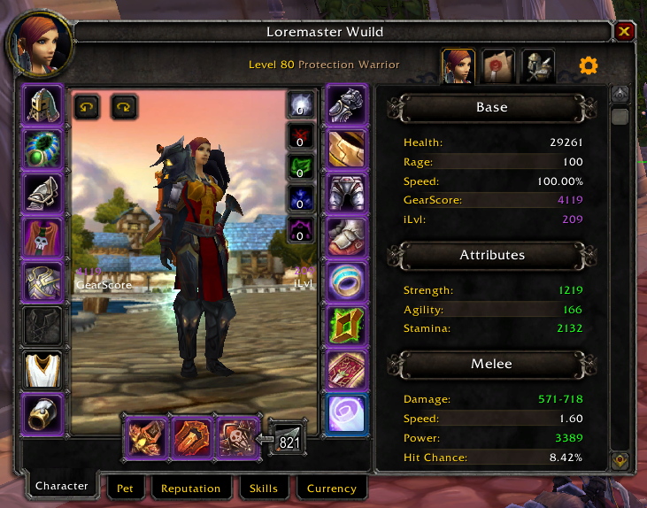
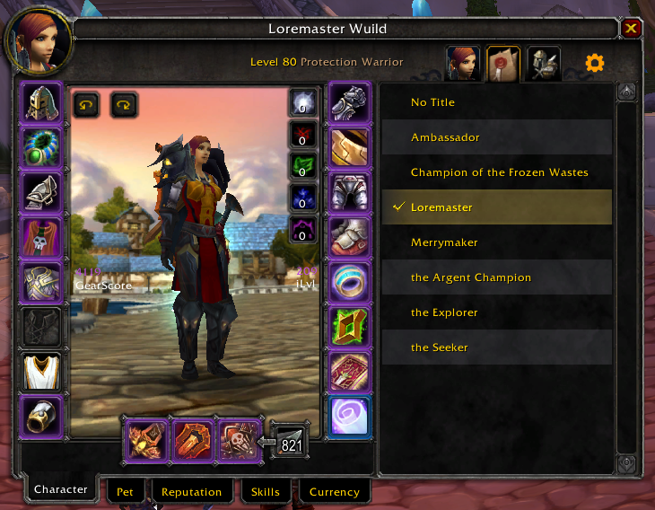
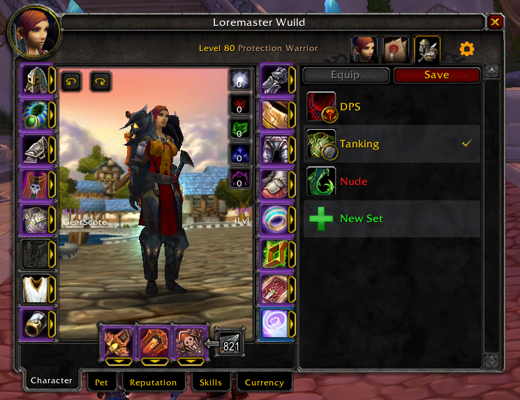

# ExtraStats

ExtraStats is a simple character screen extender which displays different kind of stats accurate, including buffs,
flasks, racial benefits etc.

Now comes in a handy extended character window with titles and equipment manager.

[](https://www.buymeacoffee.com/yuImx6KOY "Buy Me A Coffee")

### INSTALLATION

Extract the data to your "World of Warcraft/Interface/AddOns" directory so that the "ExtraStats" directory is a
subdirectory of the "AddOns" directory.

### EXAMPLE





### CONTRIBUTING

ExtraStats is an open source project, and is built with the support of the community.
A special thank you to the guild Crits and Giggles for helping me create this addon

Repository: [https://github.com/wuild/extrastats]
Issue Tracking: [https://github.com/wuild/extrastats/issues]

### PLUGIN AND EVENT API

Register a plugin:

```
local Plugin = { name = "MyPlugin" }
ExtraStats:RegisterPlugin(Plugin)
```

Common events you can hook with `ExtraStats:On(event, callback)`:
- `stats.tab.show`, `stats.tab.hide`
- `titles.tab.show`, `titles.tab.hide`
- `gear.tab.show`, `gear.tab.hide`
- `stats.update.start`, `stats.update.end`
- `stats.category.created`
- `stats.category.stat.added`
- `category:build`
- `stat:build`
- `character.window.show`, `character.window.hide`

### PLUGIN GUIDE

Minimal plugin example:

```
local Plugin = { name = "MyPlugin" }
ExtraStats:RegisterPlugin(Plugin)

function Plugin:Setup()
    if ExtraStats.db.char.disabledPlugins[Plugin.name] == true then
        return
    end

    local stats = ExtraStats:LoadModule("character.stats")
    local base = stats:GetCategory("base")
    if base then
        base:Add("Example Stat", function()
            return { value = "42" }
        end)
    end

    ExtraStats:On("stats.update.start", function()
        -- before stats rebuild
    end)
end
```

Tips:
- Use `ExtraStats:RegisterPlugin` to avoid duplicate registrations.
- Guard optional dependencies before doing work.
- Use `ExtraStats:On(...)` to hook into tab and stats lifecycle.
- If you add stats, call `ExtraStats:MarkStatsDirty("base")` to refresh the tab.

When LibDataBroker is available, ExtraStats exposes a clickable gear-set
dropdown for Titan Panel and Bazooka.
