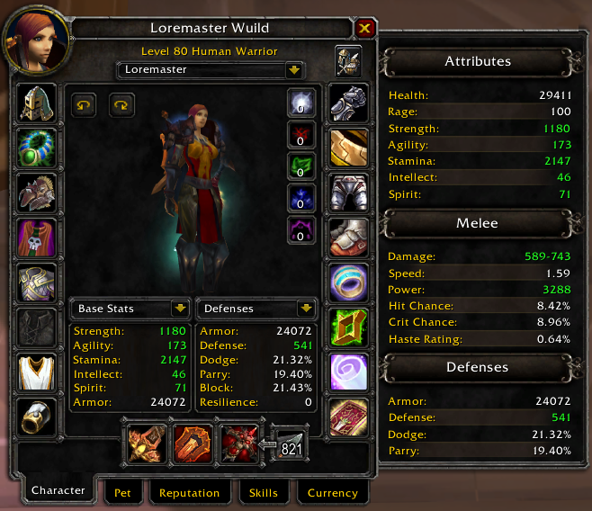

# ExtraStats

ExtraStats is a simple character screen extender which displays different kind of stats accurate, including buffs,
flasks, racial benefits etc

### INSTALLATION

Extract the data to your "World of Warcraft/Interface/AddOns" directory so that the "ExtraStats" directory is a
subdirectory of the "AddOns" directory.

### EXAMPLE

### CONTRIBUTING

ExtraStats is an open source project, and is built with the support of the community.
A special thank you to the guild Crits and Giggles for helping me create this addon

Repository: [https://github.com/wuild/extrastats]
Issue Tracking: [https://github.com/wuild/extrastats/issues]
